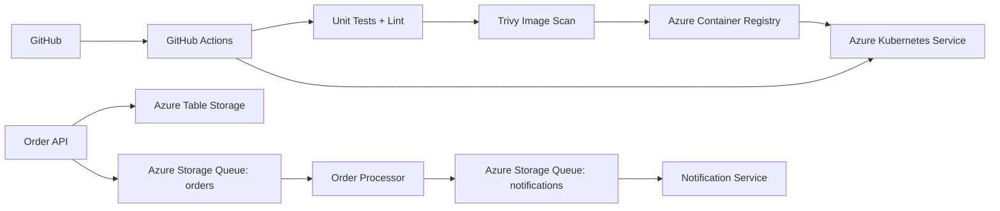

# Order Processing Platform — Terraform + AKS + Docker + CI/CD

A hands-on DevOps/Cloud Engineering assignment implementing three small Node.js/TypeScript services:

- **Order API** — accepts orders, persists them in Azure Table Storage, and enqueues work.
- **Order Processor** — consumes order messages and emits notification messages.
- **Notification Service** — consumes notification messages and simulates delivery.

Infrastructure is provisioned with Terraform on Azure. Containers are built/scanned with GitHub Actions, pushed to Azure Container Registry (ACR), and deployed to Azure Kubernetes Service (AKS) with Helm.

## Architecture



### Service communication

1. Client calls `POST /orders` on Order API.
2. Order API writes the order to Table Storage and places an order message on the `orders` queue.
3. Order Processor consumes the message, performs processing, and sends a notification message to `notifications`.
4. Notification Service consumes the notification message and logs the simulated delivery.

The services communicate asynchronously through queues rather than calling each other directly. This reduces coupling and allows each worker to scale independently.

## Repository structure

```text
order-processing-platform/
├── services/
│   ├── order-api/
│   ├── order-processor/
│   └── notification-service/
├── infra/
│   ├── main.tf
│   ├── variables.tf
│   ├── outputs.tf
│   ├── providers.tf
│   ├── terraform.tfvars.example
│   └── modules/
│       ├── acr/
│       ├── aks/
│       └── storage/
├── helm/order-processing-platform/
├── .github/workflows/ci-cd.yml
└── docs/
```

## Prerequisites

- Node.js 20+
- Docker + Docker Compose
- Azure CLI
- Terraform 1.7+
- kubectl
- Helm 3+
- An Azure subscription
- GitHub repository with GitHub Actions enabled

## Run locally

```bash
npm install
npm test
npm run build
npm run lint

docker compose up --build
```

The local stack uses Azurite as an Azure Storage emulator. Order API listens on `http://localhost:3000`.

Create an order:

```bash
curl -X POST http://localhost:3000/orders \
  -H 'Content-Type: application/json' \
  -d '{"customerId":"C1001","items":[{"sku":"SKU-001","quantity":2}],"total":29.98,"email":"customer@example.com"}'
```

Health checks:

```bash
curl http://localhost:3000/health
```

## Azure deployment with Terraform

Authenticate:

```bash
az login
az account set --subscription <SUBSCRIPTION_ID>
```

Copy the example variables and fill in your values:

```bash
cp infra/terraform.tfvars.example infra/terraform.tfvars
```

Then:

```bash
cd infra
terraform init
terraform fmt -recursive
terraform validate
terraform plan
terraform apply
```

Terraform provisions:

- Azure Resource Group
- Azure Container Registry
- AKS cluster with a small Linux node pool
- Azure Storage Account with Table Storage + queues
- Outputs for ACR login server, AKS resource group/name, and storage connection string

> For production, do not output a storage connection string. This assignment keeps it in Terraform output only to make the lab easier to wire up. A production implementation should use managed identity/Workload Identity and Key Vault.

## Helm deployment

Get AKS credentials:

```bash
az aks get-credentials --resource-group <AKS_RESOURCE_GROUP> --name <AKS_NAME> --overwrite-existing
```

Create/update Kubernetes secrets without committing them:

```bash
kubectl create secret generic order-processing-secrets \
  --from-literal=AZURE_STORAGE_CONNECTION_STRING='<VALUE>' \
  --dry-run=client -o yaml | kubectl apply -f -
```

Install the chart:

```bash
helm upgrade --install order-processing ./helm/order-processing-platform \
  --set global.imageRegistry='<ACR_LOGIN_SERVER>' \
  --set imagePullSecrets[0].name=acr-auth
```

For the GitHub pipeline, ACR authentication is handled by Azure login + `az acr login`, and the cluster pulls using the generated `acr-auth` secret in the deployment job.

## GitHub Actions setup

Configure these GitHub repository variables/secrets:

- `AZURE_CLIENT_ID`
- `AZURE_TENANT_ID`
- `AZURE_SUBSCRIPTION_ID`
- `AKS_RESOURCE_GROUP`
- `AKS_CLUSTER_NAME`
- `ACR_NAME`
- `ACR_LOGIN_SERVER`
- `STORAGE_CONNECTION_STRING`

Recommended Azure setup is GitHub OIDC federation rather than a long-lived client secret.

Pipeline stages:

1. checkout
2. npm install + lint + unit tests + build
3. Terraform validate
4. Docker build
5. Trivy vulnerability scan
6. push versioned images to ACR
7. connect to AKS
8. create/update Kubernetes secret
9. Helm upgrade/install
10. rollout validation
11. smoke test

The image tag is the immutable Git commit SHA, so the same versioned image is promoted through deployment.

## Troubleshooting challenge

The repository intentionally documents a realistic failure in `docs/troubleshooting.md`: an incorrect image tag causes `ImagePullBackOff`. The evidence section shows the commands used to identify the issue, the root cause, and the corrected Helm value.

## Cost management

See `docs/cost-optimization.md` for practical actions including AKS node sizing, autoscaling, log retention, storage lifecycle controls, and dev/test shutdown schedules.

## Security notes

- No credentials are committed.
- `.tfvars` is ignored by Git.
- Trivy scans container images before deployment.
- GitHub OIDC is preferred over stored Azure client secrets.
- Kubernetes secrets are injected at deployment time.
- Production should use AKS Workload Identity + Key Vault rather than storage connection strings.
