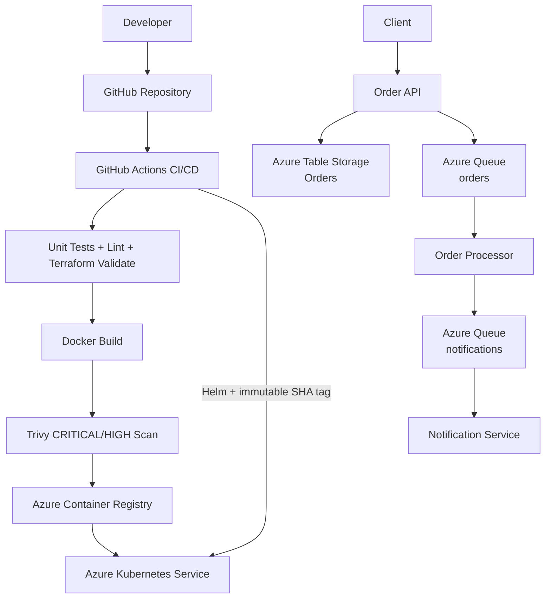

# Architecture Diagram

## Design rationale

The API is synchronous only at the edge. Internal processing is asynchronous. Queue boundaries provide loose coupling, retry capability through queue visibility timeouts, and independent scaling of worker services.
